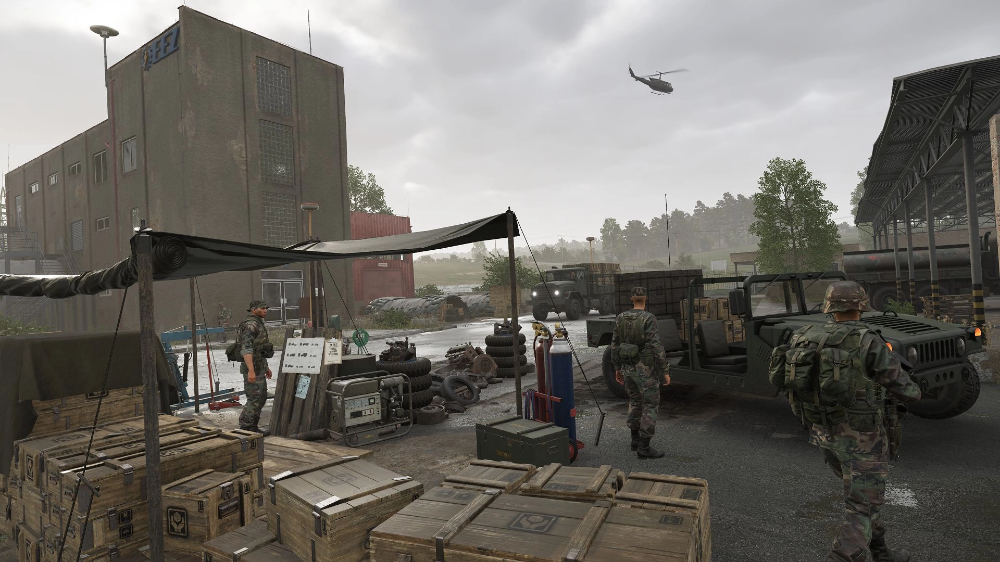

# Welcome to the Arma Reforger Tactical Guide!

**Listen up, soldier!** Welcome to the battlefield. This here’s the Arma Reforger Tactical Guide, your one-stop manual for staying alive and making an impact out there. Whether you’re a fresh recruit still figuring out which end of the rifle to point or a battle-hardened veteran with a thousand-yard stare, this guide’s got something for you. We’re here to whip you into shape, sharpen your skills, and turn you into a force to be reckoned with in the world of Arma Reforger.

This guide is the result of a community effort, pieced together by the sharpest minds on the front lines and hosted on GitHub. Think you’ve got something to add? Step up, contribute, and help us make this guide even better.

Please note that **this is not a tutorial** on how to play Arma Reforger. If you’re unfamiliar with the game’s basic mechanics, we highly recommend completing the in-game tutorial first to familiarise yourself with core gameplay systems and controls. Once you have the basics covered, this guide will help you elevate your skills to the next level.

We’re focused on the **Conflict game mode**, where every decision counts and survival means outsmarting, outmanoeuvring, and outgunning the enemy. While we stick to the vanilla game for maximum accessibility, the principles here will still serve you well in modded versions. But don’t expect us to spoon-feed you about mods—that’s not what this is about.

### How to contribute to these guides
This guide’s built by the community, for the community. Got a better way to flank an enemy position? Found a smarter way to handle logistics? Get over to GitHub and share your wisdom, soldier. Together, we can make this the ultimate tactical playbook for Arma Reforger.

### **Disclaimer**
While this guide offers strategies and insights based on community knowledge and experience, every battle is different, and adaptability is key to success. Use these tips as a foundation, but be prepared to think on your feet and adjust to changing scenarios.

### About the Creation of This Guide
We have utilised large language models (LLMs) to help expedite the creation and organisation of this content. However, all the knowledge, expertise, and strategies provided here were hand-written and stem from human experience with Arma Reforger. The LLMs were simply tools to streamline the writing process and ensure clarity.