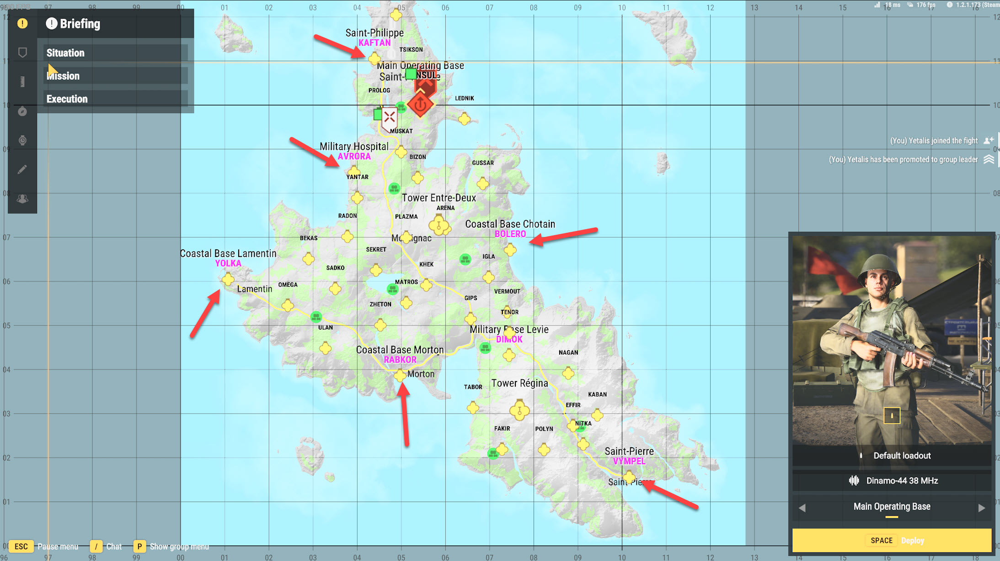

# What is conflict?

The Conflict gamemode sees two teams fighting for supremacy over the island. These games rely on working as team, doing supply runs and capturing bases.

To win, one side must capture the strategic objectives marked **purple** on the map, on Everon you must capture at least 5 to win, on Arland you must capture two.

Every objective on the map can be capture but you must be in your factions radio signal range, otherwise they cannot be secured. The more military sites and communications you capture, the greater you can become.

## Teams
There is two teams *Soviet* and *US* on the map everything in red is owned by the Soviet Team, everything Blue is owned by the US Team. Everything green is owned by the FIA faction which are controlled by AI.

