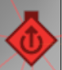
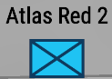

:::warning
This page needs cleanup, images need cleaning up. Some information needs formatting better. Please help!
:::

# Understanding the map

## Symbology
On the map there is multiple objectives, you will see some symbols, here is what they mean.

### Bases

Bases have three distinct symbols depending on the faction. The larger the symbol on the map the bigger the base is. 

The symbol below in any base means that its your base and you can spawn there.

#### US Base
 

The US bases are marked with a blue rectangle.

This specific symbol means this is a tower. Towers are not bases but they increase the teams radio range by a lot. They are very strategic to capture.

#### Soviet Base

The Soviet bases are marked with a red triangle.

#### FIA Base
 

FIA bases are controlled by AI, by default at the start of the round they control all bases. These basses are marked by a green square.

#### Supply Base

These are bases controlled by FIA which will allow you to grab supplies from them, they have a lot of supplies which respawn, the defenders of these bases are FIA and you will need to kill them, they respawn after a certain amount of time.

#### *Unknown Base

These are bases which are outside of your current radio range. You can extend the radio range and see who controls them currently.

#### Base Information

 

If you hover over any base it will give you information about the base.

The top line **Main Operating Base** indicates the name. There is then symbols below this which indicate what has been built at the base, from left to right they are.

1. Armoury (Allows you to get gear and spawn with custom gear)
2. Light Vehicle Base (Allows you to spawn light vehicles and repair them)
3. Heavy Vehicle Base (Allows you to spawn heavy vehicles and repair them)
4. Field Hospital (Allows you to heal and spawn AI units)
5. Field Barracks (Allows you to spawn AI)
6. Tower Relay (Increases the radio range of the base, allowing you to capture more)
7. Helicopter Pad (Allows spawning of helicopters)
8. Fuel Point (Allows refueling of vehicles)

Underneath that shows how many supplies are in the base, how much is replinished.

### Objectives

#### Current Objective

Your current objective is marked by a blue triange. You can select inactive objectives and assign them as your primary objective, this will allow others to see you are going to capture it and gives you bonus XP.

#### In-active Objective

This is a base which you can capture but is not your current objective. You can select it to make it your active objective.

### Team

You can see friendly squad leaders on the map from this symbol, it will show the group name. Not every soldier is shown on the map, only squad leaders. You cannot see your own position on the map.