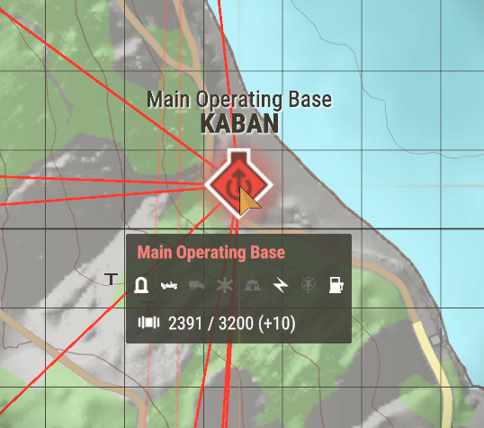

:::warning
This page needs cleanup, images need cleaning up. Some information needs formatting better. Please help!
:::

# Supplies

## What are supplies?
Supplies are the backbone of the gamemode. You need supplies to do everything.
When you spawn it will consume supplies for your equipment, anytime you spawn a vehicle it will consume supplies, everytime you build something in base it will consume supplies.

*A team without supplies is a bad team*

## Where are supplies stored?
In the base there is a few places they are stored. 

1. Command Tent (500 Supplies)
2. Ammunition Supply Point (2100 Supplies)
3. Vehicle Maintenance Point (500 Supplies)
3. Heavy Vehicle Maintenance Point (1200 + 1700 + 1700 Supplies)
4. Living Quarters
5. Field Hospital
6. Helipad

You can see where supplies are by looking for these symbols around the base, you can also physically see when there is supplies at each of these base types.

If you get a truck or vehicle which can hold supplies you can load and unload supplies nearby, this means you can transport supplies to other bases or buildings.

You will get XP for unloading supplies at a base.

## How do you get more supplies?

### Waiting
Some bases will get automatic replinishment of supplies.
This is indicated below by the + symbol, this will accumalate that amount every 5 seconds, so below this base gets 10 supplies every 5 seconds automatically.

### Transporting Supplies
As mentioned above if you get a truck or vehicle you can drive it to one of the supply areas in the base and you will get an option to load supplies. You can transport this to another building or base and then unload them for XP. This is a fundamental skill and is needed in Conflict to ensure supplies are always moving to the front line.

### Neutral Supply Bases
On the map there is neutral supply bases which are marked by a green square. These are owned by the FIA and contain a large number of supplies which replenishes quickly, the AI also do respawn in time. You can use these bases to grab more supplies for your own bases.
